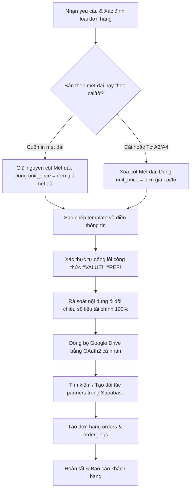

# Kỹ năng Tạo Báo giá và Đồng bộ hóa Đơn hàng Prink Tech

Kỹ năng này quy định quy trình chuẩn hóa từ thiết kế báo giá, cấu trúc lưu trữ cục bộ/Drive đến đồng bộ cơ sở dữ liệu Supabase của website Prink Tech, đảm bảo tính đồng nhất giữa tất cả các phiên AI Agent.

---

## 📋 1. QUY TRÌNH THỰC HIỆN CHUẨN

---

## 📂 2. NGUYÊN TẮC CẤU TRÚC VÀ ĐẶT TÊN THƯ MỤC

### 2.1 Cấu trúc & Quy tắc STT Đồng bộ (BẮT BUỘC KIỂM TRA DRIVE TRƯỚC)
- **Quy tắc Kiểm tra STT**: Trước khi tạo thư mục khách hàng mới, Agent **bắt buộc phải quét danh sách thư mục trên Google Drive** (thư mục cha `1HKqBw0DKnmQvcXzyjo9cgtrFl15Ehj24`) để tìm `STT` lớn nhất hiện tại. Số thứ tự mới sẽ là `STT_Mới = STT_Lớn_Nhất + 1`.
- **Thư mục lưu trữ Cục bộ (Local Directory)**: `bao_gia/[STT]. [Ten_Khach_Hang]_C_[So_Dien_Thoai]`
  *(Ví dụ: `bao_gia/5. Nguyen_Duc_Nghia_C_0334626393`)*
- **Thư mục Google Drive**: `[STT]. ${customer_name} - ${customer_phone}` *(Ví dụ: `5. Nguyễn Đức Nghĩa - 0334626393`)*
- **Danh sách file bắt buộc**:
  1. `1. Bao_gia_in_tem_UV_DTF_[Ten_Khach_Hang]_V2.xlsx` (Bảng tính Excel báo giá gốc)
  2. `2. Bao_gia_in_tem_UV_DTF_[Ten_Khach_Hang]_V2.pdf` (Tệp PDF xuất ra gửi khách)
  3. `3. [ten_khach_hang_slug]_nesting_layout.webp` (Ảnh maket bế demi dàn trang cuộn in thực tế)
  4. `5. [ten_khach_hang_slug]_wood_mockup.webp` (Ảnh mockup sản phẩm - nếu có)
- **Lưu ý**: **Không tạo file `4. Thong_tin_giao_hang.txt`** nữa (vì dòng địa chỉ đã được nhúng trực tiếp vào báo giá). Sử dụng hậu tố `_V2` cho tên file Excel/PDF để tránh lỗi khóa tệp (`Permission denied`) do các tiến trình ngầm (Google Drive Desktop, Antivirus, Explorer Preview Panel) gây ra trên hệ thống Windows.

### 2.2 Google Drive
- **Thư mục cha**: `1HKqBw0DKnmQvcXzyjo9cgtrFl15Ehj24` (Thư mục Báo giá chung của dự án)
- **Thư mục con**: `[STT]. ${customer_name} - ${customer_phone}` *(Ví dụ: `5. Nguyễn Đức Nghĩa - 0334626393`)*
- **Quyền hạn**: Phải cấp quyền đọc công khai (`anyone` as `reader`) cho thư mục con sau khi tạo để website load ảnh / file không bị lỗi phân quyền.

---

## 📊 3. TIÊU CHUẨN THIẾT KẾ FILE BÁO GIÁ EXCEL/PDF

### 3.1 Bắt buộc sử dụng file template
Luôn sử dụng file template Excel gốc tại:
`D:\16. Code\32-website-prinktech\.agents\skills\antigravity-prinktech-quote\resources\template_bao_gia.xlsx`
Sao chép tệp này sang thư mục khách hàng mới, mở bằng openpyxl và điền các trường dữ liệu. Điều này giữ nguyên vẹn **hình ảnh logo chất lượng cao** nhúng ở ô A1.

### 3.2 Quy tắc Cột Mét dài (Bắt buộc)
1. **Đơn hàng in theo cuộn mét dài**:
   - Giữ nguyên cột E ("Dài phân bổ (m)").
   - Dòng Quy cách (dòng 6) ghi rõ: `Quy cách: Cuộn khổ 58cm | [Độ dài] mét dài phân bổ...`
2. **Đơn hàng đặt tem riêng (bán theo số cái) hoặc tờ A3/A4**:
   - **Bắt buộc xóa cột E (Mét dài)** bằng lệnh `ws.delete_cols(5, amount=1)`.
   - Dòng Quy cách (dòng 6) không đề cập mét dài: `Quy cách: Tem UV DTF bọc màng định hình bế sẵn` hoặc `Tờ ghép A3/A4`.
   - Cập nhật công thức Thành tiền dòng 10: `=D10*E10` (Số lượng × Đơn giá trước VAT).
   - Cập nhật công thức khối Tổng cộng dòng 11: `D11` = `=SUM(D10:D10)`, `F11` = `=SUM(F10:F10)`, `G11` = `=F11/D11`.
   - Cập nhật khối VAT: Cột nhãn merge `E:F`, cột số tiền là `G`. `G13` = `=F11`, `G14` = `=G13*0.08`, `G15` = `=G13+G14`, `G16` = `[Phí ship]`, `G17` = `=G15+G16`.

### 3.3 Thiết kế chung
- **Phông chữ**: Chỉ sử dụng duy nhất font `Segoe UI`. Bật hiển thị Gridlines: `ws.views.sheetView[0].showGridLines = True`.
- **Địa chỉ khách hàng**: **Dòng địa chỉ giao hàng của khách hàng nằm ở dòng số 7** của file Excel (ngay dưới dòng Tên khách hàng ở dòng 6) để hiển thị thông tin đầy đủ, chi tiết.
- **Tiêu đề phụ D2**: Ghi nhận số đơn hàng chính thức: `Đơn hàng: [Mã đơn hàng]` (Ví dụ: `Đơn hàng: ORD-20260713-8821`) để báo giá đồng bộ với hệ thống kế toán.
- **PDF Export**: Thiết lập Page Setup của Sheet về khổ đứng (Portrait), FitToPagesWide = 1, FitToPagesTall = 1 trước khi xuất PDF thông qua `win32com.client`.

---

## 🔍 4. QUY TẮC RÀ SOÁT & XÁC THỰC BẮT BUỘC (VERIFICATION GATES)

### 4.1 Xác thực Lỗi công thức (Tự động)
Sau khi ghi dữ liệu và trước khi chuyển đổi sang PDF, Agent bắt buộc phải kiểm tra:
1. **Ép Excel tính toán lại đầy đủ**: Gọi `excel_app.CalculateFull()` thông qua win32com client.
2. **Kiểm tra giá trị hiển thị (Text Value)** của tất cả các ô công thức chủ chốt (`G10`, `H10`, `D11`, `E11`, `G11`, `H11`, `H13`, `H14`, `H15`, `H17` đối với đơn có mét dài, hoặc `F10`, `G10`, `D11`, `F11`, `G11`, `G13`, `G14`, `G15`, `G17` đối với đơn không mét dài).
3. **Phát hiện lỗi và từ chối xuất PDF**: Nếu bất kỳ ô nào chứa chuỗi lỗi (`#VALUE!`, `#REF!`, v.v.), bắt buộc phải ném lỗi (Raise Error), dừng chương trình ngay lập tức và rà soát lại công thức Excel.

### 4.2 Rà soát Nội dung & Đối chiếu số liệu tài chính (Bắt buộc)
Agent phải tự động hoặc thủ công rà soát danh sách kiểm tra (Checklist) sau đây trước khi bàn giao:
- `[ ]` **Đối chiếu Tên & SĐT**: Khớp chính xác với thông tin khách hàng cung cấp.
- `[ ]` **Đối chiếu Địa chỉ giao hàng**: Phải hiển thị đúng, đủ tại dòng số 7 và phần "Vận chuyển" ở điều khoản thanh toán.
- `[ ]` **Xác minh Thuế VAT (8%)**: Kiểm tra xem công thức tính VAT có khớp đúng 8% trên tiền hàng chưa VAT không.
- `[ ]` **Xác minh Phí vận chuyển**: Khớp đúng số tiền ship đã thỏa thuận (ví dụ: 30k).
- `[ ]` **Đối chiếu Tổng thanh toán cuối cùng**: Công thức `=Tiền hàng đã gồm VAT + Phí ship` phải cho ra kết quả khớp chính xác với số tiền cuối cùng thỏa thuận với khách.
- `[ ]` **Kiểm tra hiển thị Logo**: Logo Prink Tech tại ô A1 phải hiển thị đầy đủ, đúng tỷ lệ, không bị chồng đè chữ hoặc lệch vị trí.

---

## 🗄️ 5. NGUYÊN TẮC LƯU TRỮ CƠ SỞ DỮ LIỆU (SUPABASE)
- **Schema sử dụng**: Bắt buộc là `printing`.
- **Bảng Khách hàng (`partners`)**:
  - Luôn luôn tìm kiếm bằng số điện thoại trước (cả chuỗi số chuẩn hóa không dấu cách và chuỗi số gốc).
  - Nếu đối tác chưa tồn tại, thêm mới với `partner_type = 'standard'` (đây là định danh của khách hàng từ website Prink Tech, phân tách riêng với đại lý/xưởng in).
- **Bảng Đơn hàng (`orders`)**:
  - `order_code` sinh tự động có tiền tố `ORD-YYYYMMDD-XXXX`.
  - **Không insert trường `total_amount`** vì đây là cột `GENERATED ALWAYS AS` của Postgres.
  - **Đơn giá in `unit_price` và Số lượng `quantity_actual`**:
    - **Nếu in theo mét dài cuộn**: `quantity_actual` = số mét dài, `unit_price` = đơn giá in/mét đã gồm VAT 8% (tức là `Tổng tiền in gồm VAT / số mét`).
    - **Nếu bán theo cái / tờ**: `quantity_actual` = số lượng cái hoặc tờ thực tế, `unit_price` = đơn giá in của 1 cái hoặc 1 tờ đã gồm VAT 8% (tức là `Tổng tiền in gồm VAT / số lượng cái hoặc tờ`).
  - **Trạng thái đơn hàng `status`**: Bắt buộc lưu là `'pending'` (Chờ xác nhận) khi tạo đơn/báo giá mới.
  - **Liên kết file**: Lưu link thư mục Google Drive vào cột `design_link`, link ảnh layout vào `preview_image` & `layout_image`, link Excel và PDF báo giá vào cột `note`.
- **Bảng Nhật ký (`order_logs`)**:
  - Ghi nhận lịch sử hoạt động `action = 'create'` với chi tiết các thay đổi (`changes`).

---

## 💻 6. SCRIPT MẪU ĐÍNH KÈM
AI Agent có thể chạy trực tiếp các script mẫu nằm trong thư mục `examples/` của skill để thực hiện tự động hóa toàn bộ quy trình:
1. `examples/generate_quote.py`: Script Python tạo báo giá Excel & PDF chuẩn (bằng cách điền dữ liệu vào tệp template gốc, có tích hợp cơ chế tự động xác thực lỗi công thức và tuân thủ nguyên tắc Mét dài vs. Số cái/tờ).
2. `examples/sync_order.mjs`: Script NodeJS đồng bộ Drive và Supabase.
